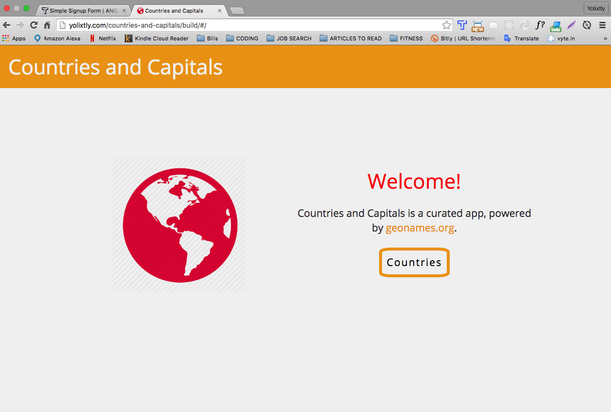
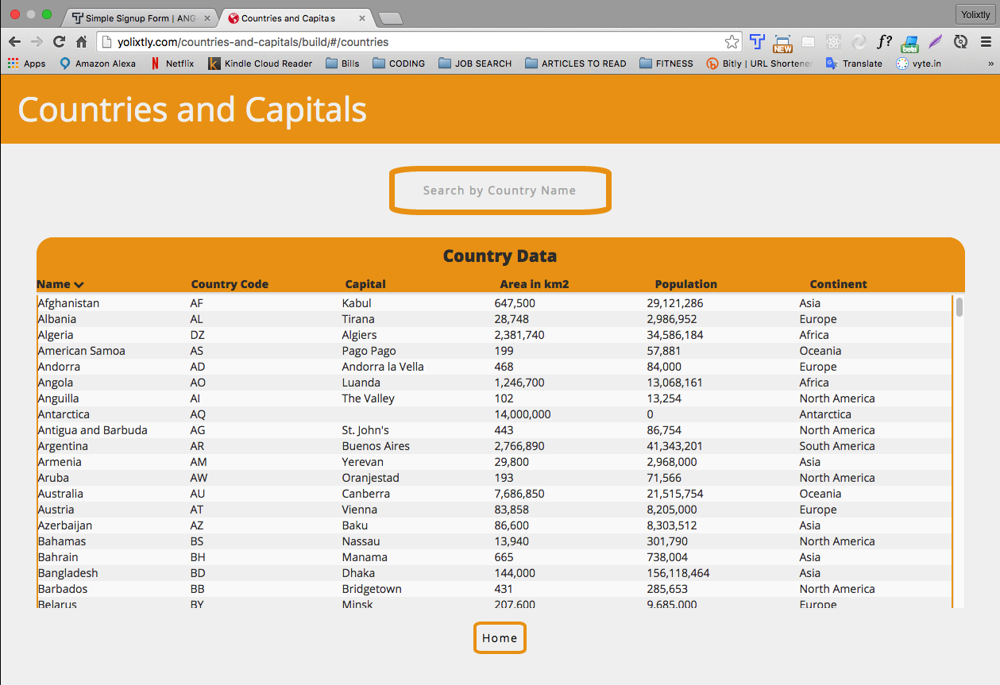
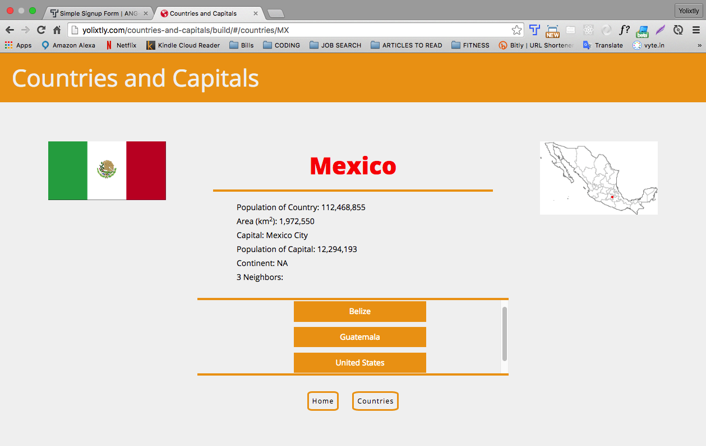
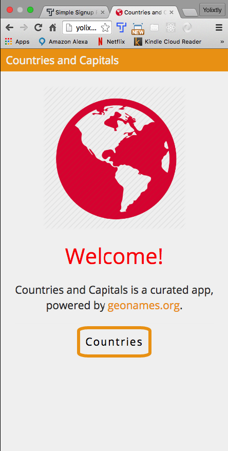
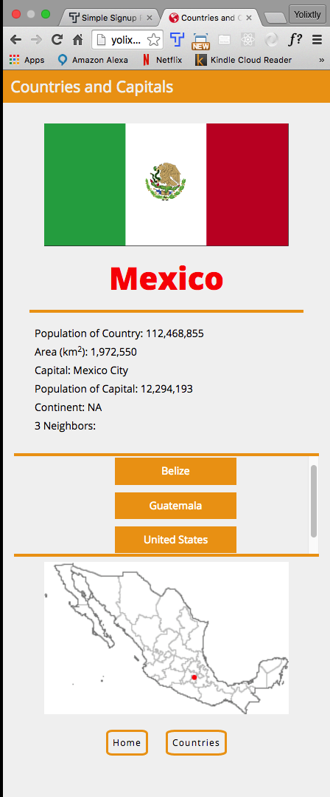

# countries-and-capitals
Angular animations, promises and XHR Requests

This App has been my most challenging yet! It took me over a week to finish it, but it was a well spent week, where I was introduced to new tools such as the <strong> task runner Gulp </strong> also for the first time I applied <strong> a unit Testing </strong> 

Some of the problems I went trhough are :

- Mixing Conflicts : My API request to geonames is available only with http and Github is suporting https . The easiest solution was to simply create my own domain. 

- I had multiple errors <em>module is not defined</em>. This is because I had multiple modules and the submodules were not injecting the correspondant dependencies. By understanding the difference between creating a module and referencing it, multiple problems where solved.

Responsive design: 

